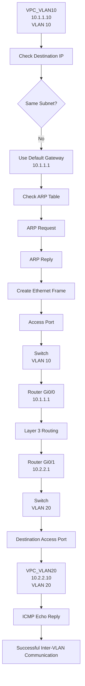
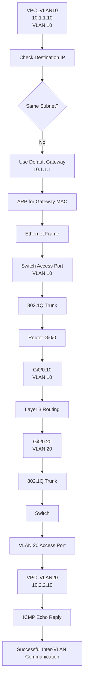

Yes. The main issue is that `<br>` by itself can behave inconsistently in GitHub Markdown. For reliable spacing, use **`<br/>`** and keep headings as proper Markdown headings.

I also fixed the sections that were appearing as paragraphs by adding `##` / `###` headings.

Copy **everything inside this single code block** into your `README.md`:

````markdown
# 🧪 Inter-VLAN Routing Lab

## 🎯 Objective

Configure communication between two different VLANs using a Cisco router
and understand how Layer 3 routing enables communication between
separate Layer 2 broadcast domains.

This lab demonstrates two approaches:

1. Inter-VLAN routing using separate physical router interfaces.
2. Router-on-a-Stick using one physical router interface with multiple subinterfaces.

<br/>

---

<br/>

## 🖥️ Topology 1 — Separate Router Interfaces

```text
                         Router
                    ┌──────┴──────┐
                    │             │
                 Gi0/0          Gi0/1
                10.1.1.1        10.2.2.1
                    │             │
                 Gi0/2          Gi0/3
                    │             │
                    └─── Switch ──┘
                       /       \
                    Gi0/0     Gi0/1
                      |          |
                   VLAN 10     VLAN 20
                      |          |
               VPC_VLAN10    VPC_VLAN20
               10.1.1.10     10.2.2.10
````

<br/>

## 🌐 IP Addressing

| Device       | VLAN | IP Address | Subnet Mask   | Default Gateway |
| ------------ | ---: | ---------- | ------------- | --------------- |
| VPC_VLAN10   |   10 | 10.1.1.10  | 255.255.255.0 | 10.1.1.1        |
| Router Gi0/0 |   10 | 10.1.1.1   | 255.255.255.0 | -               |
| VPC_VLAN20   |   20 | 10.2.2.10  | 255.255.255.0 | 10.2.2.1        |
| Router Gi0/1 |   20 | 10.2.2.1   | 255.255.255.0 | -               |

<br/>

## 🔧 Technologies

* EVE-NG
* Cisco IOS
* VPCS
* IPv4
* VLAN
* Inter-VLAN Routing
* Router Interfaces
* Router-on-a-Stick
* IEEE 802.1Q
* ARP
* ICMP

<br/>

## 🔹 VLAN Configuration

Created VLAN 10 and VLAN 20 on the switch.

```cisco
vlan 10
 name VLAN10

vlan 20
 name VLAN20
```

<br/>

### Access Port Configuration

#### VLAN 10

```cisco
interface gigabitEthernet0/0
 switchport mode access
 switchport access vlan 10
```

<br/>

#### VLAN 20

```cisco
interface gigabitEthernet0/1
 switchport mode access
 switchport access vlan 20
```

<br/>

### Verification

```cisco
show vlan brief
```

<br/>

📸 **Add Screenshot — VLAN and access port verification.**

<br/>
<br/>

# 1️⃣ Initial Design — Separate Physical Router Interfaces

In the initial design, each VLAN uses a separate physical router
interface as its Layer 3 gateway.

<br/>

```text
VLAN 10
10.1.1.0/24
     |
     | Gateway: 10.1.1.1
     |
Router Gi0/0

VLAN 20
10.2.2.0/24
     |
     | Gateway: 10.2.2.1
     |
Router Gi0/1
```

<br/>

### Router Configuration

```cisco
interface gigabitEthernet0/0
 ip address 10.1.1.1 255.255.255.0
 no shutdown

interface gigabitEthernet0/1
 ip address 10.2.2.1 255.255.255.0
 no shutdown
```

<br/>

---

<br/>

## 📊 Communication Process — Initial Design

When VPC_VLAN10 communicates with VPC_VLAN20, the destination
belongs to a different IP subnet.

<br/>



<br/>

### How It Works

VPC_VLAN10 determines that `10.2.2.10` belongs to a different
subnet. Therefore, it sends the traffic to its default gateway
`10.1.1.1`.

The router receives the packet on `Gi0/0`, performs a Layer 3 routing
lookup, and forwards the packet through `Gi0/1` toward the
`10.2.2.0/24` network.

The destination host then returns the ICMP Echo Reply through its
default gateway `10.2.2.1`.

<br/>
<br/>

---

<br/>

# ⚠️ Problem with the Initial Design

The initial design successfully provides inter-VLAN communication,
but it requires a separate physical router interface for each VLAN.

<br/>

### Example

```text
VLAN 10 → Router Gi0/0
VLAN 20 → Router Gi0/1
VLAN 30 → Router Gi0/2
VLAN 40 → Router Gi0/3
```

<br/>

As the number of VLANs increases, more physical router interfaces
are required.

<br/>

### Limitations

* Higher physical interface consumption
* More physical cabling
* Limited scalability
* Increased hardware requirements
* Less efficient use of router interfaces

<br/>

This creates a physical interface scalability problem.

<br/>
<br/>

---

<br/>

# 2️⃣ Solution — Router-on-a-Stick

Router-on-a-Stick solves the physical interface limitation by using
one physical router interface with multiple logical subinterfaces.

The router-to-switch connection operates as an 802.1Q trunk and
carries traffic for multiple VLANs over the same physical link.

<br/>

```text
                    Router
                     Gi0/0
                       |
                 802.1Q Trunk
                       |
                    Gi0/2
                    Switch
                   /      \
                Gi0/0     Gi0/1
                  |         |
              VLAN 10     VLAN 20
                  |         |
           10.1.1.10    10.2.2.10
```

<br/>

📸 **Add Screenshot — Router-on-a-Stick topology.**

<br/>

The trunk carries both VLAN 10 and VLAN 20 traffic between the
switch and router.

<br/>
<br/>

---

<br/>

## 🔗 Router-on-a-Stick Configuration

### Physical Interface

```cisco
interface gigabitEthernet0/0
 no ip address
 no shutdown
```

<br/>

### VLAN 10 Subinterface

```cisco
interface gigabitEthernet0/0.10
 encapsulation dot1Q 10
 ip address 10.1.1.1 255.255.255.0
```

<br/>

### VLAN 20 Subinterface

```cisco
interface gigabitEthernet0/0.20
 encapsulation dot1Q 20
 ip address 10.2.2.1 255.255.255.0
```

<br/>
<br/>

## 🔗 Switch Trunk Configuration

The switch interface connected to the router is configured as an
802.1Q trunk.

<br/>

```cisco
interface gigabitEthernet0/2
 switchport mode trunk
 switchport trunk allowed vlan 10,20
```

<br/>

The trunk carries both VLAN 10 and VLAN 20 traffic between the
switch and router.

<br/>
<br/>

---

<br/>

## 📊 Communication Process — Router-on-a-Stick



<br/>

### How It Works

The source host identifies that the destination belongs to another
subnet and sends the packet to its default gateway.

The switch forwards the VLAN 10 traffic toward the router over the
802.1Q trunk.

The router receives the tagged traffic on the physical interface and
processes it through subinterface `Gi0/0.10`.

The router performs a Layer 3 routing lookup and forwards the packet
through subinterface `Gi0/0.20`, which represents VLAN 20.

The traffic then travels back through the trunk to the switch and is
forwarded through the VLAN 20 access port to the destination host.

<br/>
<br/>

---

<br/>

## 🔍 Verification

### Check VLANs

```cisco
show vlan brief
```

<br/>

### Check Trunk

```cisco
show interfaces trunk
```

<br/>

### Check Router Interfaces

```cisco
show ip interface brief
```

<br/>

### Check Router Subinterfaces

```cisco
show running-config interface gigabitEthernet0/0.10
show running-config interface gigabitEthernet0/0.20
```

<br/>

### Check Routing Table

```cisco
show ip route
```

<br/>

### Test VLAN 10 to VLAN 20

```bash
ping 10.2.2.10
```

<br/>

### Test VLAN 20 to VLAN 10

```bash
ping 10.1.1.10
```

<br/>
<br/>

---

<br/>

## 🧪 Connectivity Verification

### VLAN 10 → VLAN 20

VPC_VLAN10 successfully communicated with:

```text
10.2.2.10
```

<br/>

### VLAN 20 → VLAN 10

VPC_VLAN20 successfully communicated with:

```text
10.1.1.10
```

<br/>

📸 **Add Screenshot — Successful Router-on-a-Stick ping test.**

<br/>
<br/>

---

<br/>

## 📝 Note

The first topology demonstrates inter-VLAN routing using separate
physical router interfaces. Each VLAN has its own physical Layer 3
router interface acting as its default gateway.

Although this design works correctly, it requires a dedicated
physical router interface for each VLAN.

<br/>

The second topology solves this limitation using Router-on-a-Stick.
A single physical router interface is divided into multiple logical
subinterfaces. Each subinterface is associated with a VLAN using
802.1Q encapsulation.

<br/>

The switch-to-router connection operates as an 802.1Q trunk, allowing
multiple VLANs to share the same physical link while the router
performs Layer 3 routing between the VLANs.

<br/>
<br/>

---

<br/>

## 💡 What Was Solved

The initial design required:

```text
1 VLAN = 1 Physical Router Interface
```

<br/>

Router-on-a-Stick changes this to:

```text
Multiple VLANs
      ↓
One Physical Router Interface
      ↓
Multiple Subinterfaces
      ↓
802.1Q Trunk
      ↓
Inter-VLAN Routing
```

<br/>

This reduces physical interface requirements and provides a more
scalable approach for VLAN-based networks.

<br/>
<br/>

---

<br/>

## ✅ Result

The initial topology successfully provided communication between
VLAN 10 and VLAN 20 using separate physical router interfaces.

<br/>

The physical interface scalability limitation was then solved using
Router-on-a-Stick. A single physical router interface was configured
with separate subinterfaces for VLAN 10 and VLAN 20, while the
switch-to-router connection was configured as an 802.1Q trunk.

<br/>

Both VLANs successfully communicated through Layer 3 routing, while
the router used the appropriate subinterface as the gateway for each
VLAN.

<br/>
<br/>

---

<br/>

## 📚 Key Learning

This lab helped me understand inter-VLAN routing, default gateways,
Layer 3 packet forwarding, physical router interfaces, router
subinterfaces, 802.1Q trunking, ARP, ICMP, and Router-on-a-Stick.

<br/>

I also learned the scalability limitation of using separate physical
router interfaces for each VLAN and how Router-on-a-Stick solves this
problem by carrying multiple VLANs over a single physical router
interface.

<br/>
```
